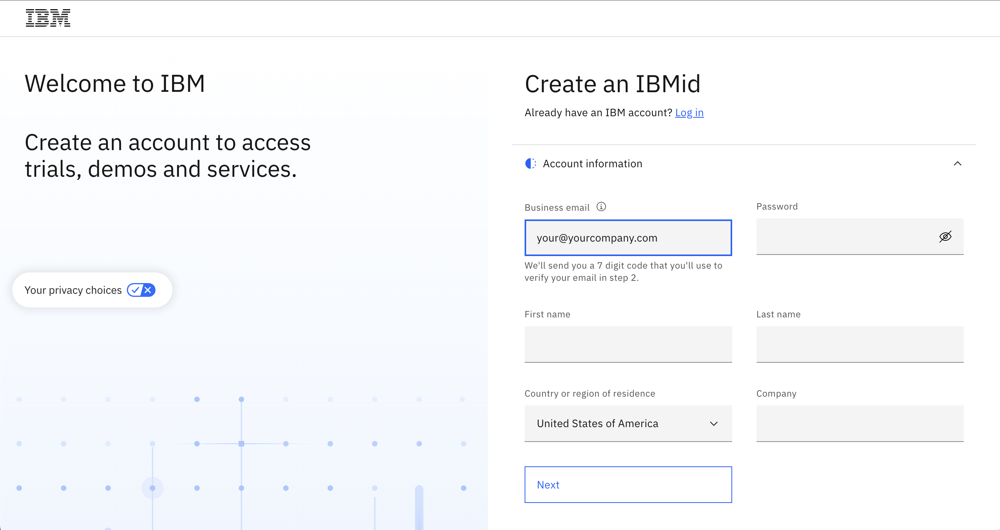

# Crear tu IBMid

**Nota:** Sigue estas breves instrucciones para crear un IBMid. Estas son específicamente para nuestros Socios de Negocio y clientes que pueden no tener acceso a un entorno TechZone previamente. Los empleados de IBM no necesitan registrarse.
Los Clientes y Socios de Negocio deben tener un IBMid antes de que los invites a los entornos del taller. No recibirán correos electrónicos invitándolos a la cuenta del taller a menos que ya tengan un IBMid.

1. Comienza accediendo a la [Página de Registro IBMid].(https://www.ibm.com/account/reg/signup?formid=urx-19776&)
2. Ingresa la información requerida en los campos proporcionados, como dirección de correo electrónico, nombre, empresa y país.

```IMPORTANTE: Tu dirección de correo electrónico se convierte en tu IBMid, ¡que usarás para acceder al entorno del bootcamp!```




4. Haz clic en el botón Siguiente. Recibirás un correo electrónico que contiene un código de verificación de un solo uso.
5. En el campo de Verificación, ingresa el código que se proporciona en el correo electrónico.
6. Haz clic en Crear cuenta.
7. Se enviará un correo electrónico indicando que la creación de tu cuenta IBMid fue exitosa y tu cuenta ahora está activada.
