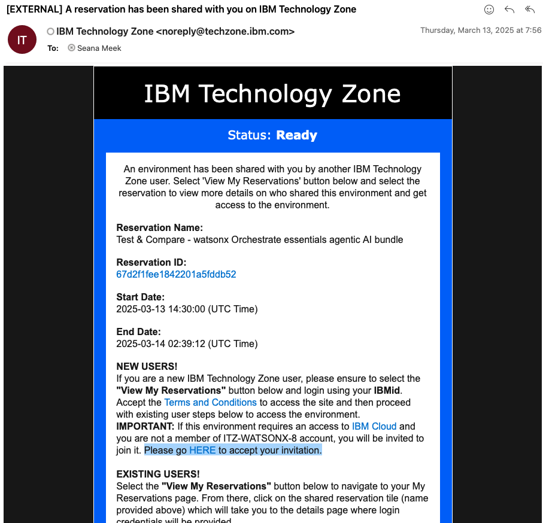
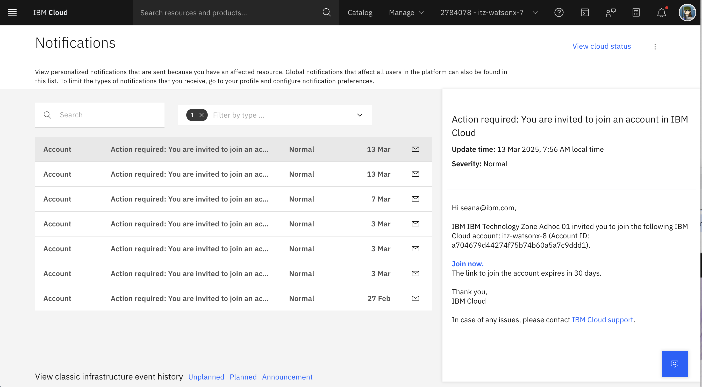

# Acceder al Entorno de Clase

**Nota:** Sigue estas instrucciones para acceder a tu instancia del entorno de clase con el fin de completar exitosamente el Bootcamp de IA Agéntica.

Cuando seas invitado al entorno de clase, recibirás un correo electrónico. Este mensaje es de IBM Technology Zone <noreply@techzone.ibm.com> invitándote a unirte a la cuenta donde se encuentra tu entorno de clase.

En el correo electrónico, busca el enlace en la oración **"Please go HERE to accept your invitation."** (Resaltado en la captura de pantalla a continuación.)

**Opción:** ¡Si pierdes el correo electrónico o no lo recibes por alguna razón!

Puedes encontrar la invitación en tu cuenta de IBM Cloud:
[https://cloud.ibm.com/notifications?type=account](https://cloud.ibm.com/notifications?type=account)

Por favor selecciona el enlace **Unirse Ahora**.

