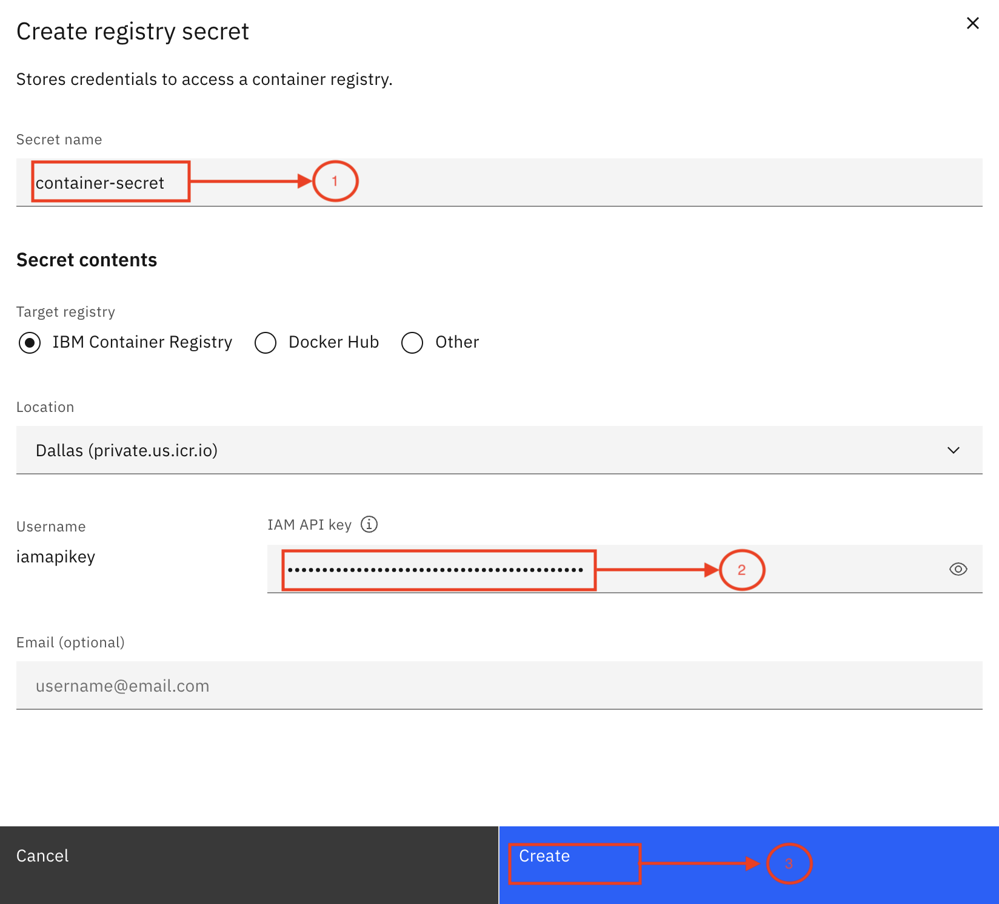
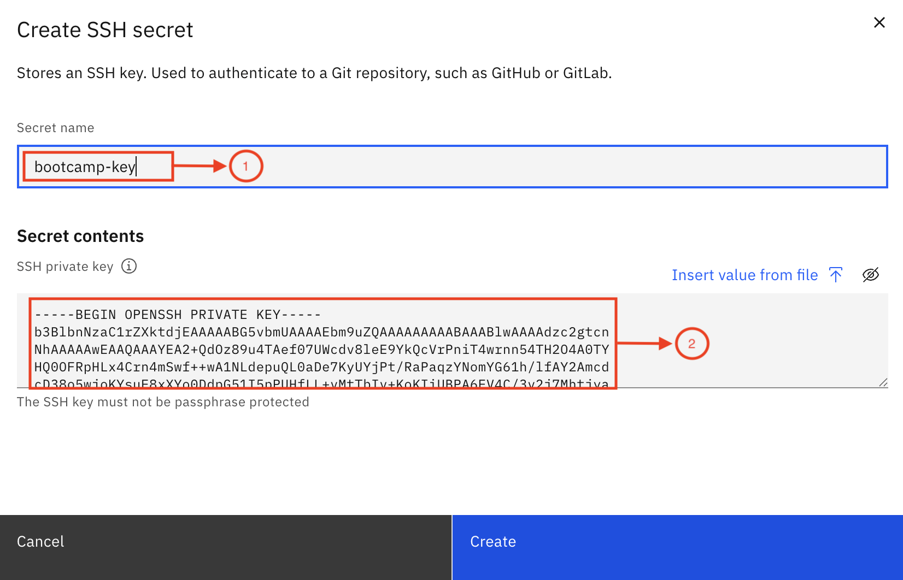

# 🤖 Creating SSH and registry secrets in Code Engine

> **NOTE:** This step is already fullfiled by the bootcamp speakers. Urls can be found in this document.
      

## Create SSH Key

Step 1: Open the terminal on your laptop.

      > **NOTE:** For a windows user, use the Windows Powershell application.
      
   Step 2: Run the command `ssh-keygen -t rsa`.
   
   Step 3: Press **Enter** to accept the default file path (do not change it).
   
   Step 4: Press **Enter** twice when prompted for a passphrase, as we do not need one.
   Note: This will generate two keys - a public key and a private key.

   

   Step 5: Copy the public key using the command: `cat /path/to/publickey | pbcopy`. Make sure you include the actual path.

      - Example: `cat /Users/akshaypatel/.ssh/id_rsa.pub | pbcopy`
   
   Step 6: Open your [GitHub Enterprise](https://github.ibm.com) account on your browser, click on your profile image and then select the **Settings** option. Select "SSH and GPG Keys", or click [here](https://github.ibm.com/settings/keys).
   
   Step 7: Click the **New SSH Key** button.

   
   
   Step 8: Enter a title for the key, select "Authentication Key", and paste the public key.

   
   
   Step 9: Save the private key in a document or on a Notepad, as we will need it later.

## Create SSH and registry secrets in Code Engine

Two secrets will be required for application deployment in Code Engine:

1. Registry Secrets: these secrets will allow you to authenticate and interact with the container registry where your images will be pushed.

2. SSH Key for GitHub: this SSH key will enable access to the GitHub repository to clone the code securely.

### Steps for Creating Secrets

Step 1: On the Code Engine page, select the **Secret and configmaps** option.

   

Step 2: Click the **Create** button.

   

#### Registry Secrets 
   Step 1: Select **Registry secret** and click the **Next** button.

   

   Step 2: Add a secret name.

   Step 3: Paste the **API KEY**.

   Step 4: Click the **Create** button.

   
      
### SSH Secrets for GitHub

Now you will create an SSH secret for GitHub using the steps below.

   Step 1: Select SSH secret.

   Step 2: Click the **Next** button.

   

   Step 3: Add a secret name.

   Step 4: Copy the private key from this command `cat [privatekey/path] | pbcopy`. Make sure you include the actual path.
      - Example `cat /Users/akshaypatel/.ssh/id_rsa | pbcopy`

   Step 5: Click the **Create** button.

   

# Ask HR – Backend App Deployment Details  

⚙️ This use case simulates interactions with an HR system or database, allowing to update employee information or request time off. The following instructions show you how to set this up.

## Deployment Information  
- The backend service for the HR application is implemented using **FastAPI** and should be deployed on **IBM Code Engine** and the build image is should be created in **IBM Container Registry**. You can find the backend script in code engine [here](/usecase-setup/askhr/HCM_APP/prof_mgmt.py)
  
## API Documentation  
- The **OpenAPI specification ([hr.yaml](/usecase-setup/askhr/HCM_APP/hr.yaml))** provides API details that can be imported as tools into an agent in **watsonx Orchestrate**.

## Default app data
- The HCM Application has a set of pre-defined user details. Request the **instructor to share one user name with each of the bootcamp participants** & ask them to use that name for their transactions.

**Note**: Using names outside this will result in errors or exceptions.

| Name                   | TimeOffBalance | Job                                           | Address                                                      | RequestedTimeOff |
| ---------------------- | -------------- | --------------------------------------------- | ------------------------------------------------------------ | ---------------- |
| Daniel Anderson        | 28.61          | Chartered legal executive (England and Wales) | 383 Alisha Pine Suite 655, Lake Brandonland, LA 05900        | 10               |
| William Frazier        | 13.34          | Primary school teacher                        | 7071 Richmond Stream, North Lisa, PR 29260                   | 19               |
| Danielle Hall          | 10.06          | Magazine journalist                           | 90610 John Turnpike, Josephchester, UT 23589                 | 18               |
| Diane Conrad           | 43.88          | Cartographer                                  | 394 Miranda Burgs Apt. 445, Chavezborough, MO 37370          | 15               |
| Maria Mcdowell         | 10.71          | Chief of Staff                                | 6099 Gina Hill Apt. 258, South Ericaberg, TN 21770           | 21               |
| Mrs. Karina Williamson | 41.09          | Chief Financial Officer                       | 374 Seth Trafficway, New Makayla, MS 30134                   | 11               |
| Jacob Graham           | 15.04          | Designer, furniture                           | 10384 Jesse Plaza, East Danny, UT 07253                      | 10               |
| Jessica West           | 14.2           | Exercise physiologist                         | 11471 Christopher River Suite 073, Clarkhaven, VT 91906      | 12               |
| Rebekah Valdez         | 1.76           | Nurse, adult                                  | 63875 Gregory Manors, Port Jennifer, OH 59157                | 26               |
| Yvonne Clark           | 7.4            | Restaurant manager                            | 8204 Jacobson Hills, New Madison, TN 14193                   | 18               |
| Victoria Baker         | 44.28          | Designer, jewellery                           | 43546 Michael Trace Suite 285, Kennedyfurt, NC 22812         | 21               |
| James Harding          | 25.06          | Planning and development surveyor             | 0017 Leblanc Turnpike, East Johnny, IL 35091                 | 24               |
| Thomas Anderson        | 44.13          | Pension scheme manager                        | 8912 Morse Greens, Paynestad, ME 14640                       | 11               |
| Jennifer Rivers        | 19.88          | Chief of Staff                                | 75901 Clay Parks Apt. 314, Rogersfort, WY 11746              | 10               |
| Sarah Boyle            | 37.59          | Agricultural engineer                         | 231 Sophia Drives Suite 667, Torresside, ND 87160            | 25               |
| Mary Pruitt            | 48.32          | Audiological scientist                        | 4901 Williams Views Apt. 146, Fitzgeraldfurt, IL 06883       | 23               |
| Laura Escobar          | 17.44          | Sports therapist                              | 6231 Veronica Bridge, Seanshire, MP 47693                    | 11               |
| Becky Simmons          | 2.78           | Armed forces technical officer                | 0652 Cook Road Suite 722, Rushbury, WV 08848                 | 29               |
| Tracey Brown           | 43.95          | Clinical molecular geneticist                 | 530 Hansen Highway Apt. 812, East Kristen, ND 29791          | 18               |
| Sean Lang              | 43.71          | Dietitian                                     | 0943 Kaiser Neck, North Maxwell, PA 67942                    | 21               |
| Michael Miller         | 26.52          | Materials engineer                            | 8744 Sandra Corners, Waltersfurt, CA 07789                   | 25               |
| Victor Vincent         | 8.99           | Surveyor, planning and development            | 973 Shaw Village Suite 608, Nicholasside, HI 37194           | 30               |
| Anthony Underwood      | 46.48          | Garment/textile technologist                  | 9773 Fisher Path, Bowmantown, ME 52339                       | 25               |
| Kathleen Fowler        | 1.31           | Surveyor, planning and development            | 8387 Cheryl Island Suite 769, Debrafurt, NJ 86139            | 14               |
| John Garcia            | 11.89          | Clinical cytogeneticist                       | USCGC Barrett, FPO AA 25746                                  | 26               |
| Tracy Melton           | 15.99          | Engineer, mining                              | 225 Larry Crescent, Port Debbie, NH 90649                    | 20               |
| Allison Stevens        | 16.95          | Clinical biochemist                           | 0214 Stafford Cape, Montesfort, PR 07933                     | 14               |
| Robert Martin          | 5.26           | Architect                                     | 2198 Joseph Via Suite 708, Simpsonland, KY 14140             | 28               |
| John Smith             | 16.97          | Theatre manager                               | 098 Kara Course Suite 316, Carolynport, WA 94969             | 25               |
| Curtis Hunter          | 8.96           | Development worker, international aid         | 9020 David Squares Apt. 200, East Alexander, AR 85219        | 14               |
| Roy Andrews            | 44.52          | Pharmacologist                                | PSC 9483, Box 5134, APO AP 44198                             | 26               |
| Frank Melendez         | 16.94          | Equality and diversity officer                | 17544 Shannon Course, East Bruceshire, WY 39838              | 15               |
| James Davies           | 40.33          | Aeronautical engineer                         | 0363 Lawrence Square Suite 305, Ramirezstad, MN 40558        | 21               |
| Jessica Cole           | 27.88          | Financial manager                             | PSC 3473, Box 3456, APO AE 80628                             | 20               |
| Gerald Pollard         | 14.86          | Illustrator                                   | 6868 Jennifer Springs, Sanchezton, VT 28166                  | 23               |
| Tony Tanner            | 17.2           | Financial manager                             | 6832 Adams Mills Apt. 078, Lake Tinabury, NJ 76213           | 15               |
| Erin Anderson          | 20.22          | Clinical cytogeneticist                       | PSC 6508, Box 6671, APO AE 17304                             | 15               |
| Blake Hernandez        | 49.58          | Magazine journalist                           | 9230 Bryan Trail Apt. 168, Evelynville, HI 78623             | 26               |
| Bethany Nichols        | 33.85          | Office manager                                | 9486 Lester Spur, Huberbury, FL 91495                        | 10               |
| Renee Doyle            | 42.93          | Conservation officer, historic buildings      | 13847 Dillon Islands Suite 363, Lake Matthewside, MO 05101   | 12               |
| Michael Dominguez      | 44.95          | Equities trader                               | 89926 Giles Turnpike Apt. 174, South Cassandrastad, NJ 41871 | 11               |
| Veronica Harrell       | 26.64          | Hydrographic surveyor                         | 883 Elizabeth Manors Suite 950, Diazfurt, NV 95910           | 20               |
| Laura Richard          | 47.82          | Diplomatic Services operational officer       | 7968 Rios Rest Suite 396, Monicaton, VT 55885                | 18               |
| Deborah Bryant         | 25.75          | Ergonomist                                    | 76734 Corey Park, Davidside, RI 06348                        | 20               |
| Kevin Kelley           | 18.1           | Youth worker                                  | 795 Donald Ways, Kimshire, FM 78898                          | 10               |
| Danielle Davis         | 48.1           | Higher education careers adviser              | 188 Amanda Club, Thomasstad, CT 28765                        | 10               |
| Kenneth Perkins        | 18.26          | Senior tax professional/tax inspector         | 5011 Jones Neck, Susanberg, CA 62141                         | 17               |
| Beth Carter            | 41.46          | Geologist, engineering                        | 520 Frazier Extension, Cainbury, OR 48986                    | 11               |
| Gregory Hughes         | 11.37          | Research scientist (medical)                  | 81871 Fleming Rapids Apt. 413, South Jessica, IL 92193       | 11               |
| Tami Dominguez         | 30.05          | Merchandiser, retail                          | 546 Kellie Orchard Suite 541, Port Kevinhaven, MI 61050      | 13               |

# App deployment Guide:
## Reserving the techzone instance

Reserve the techzone instance that includes watsonx.ai, watsonx orchestrate, IBM code engine and Container Registry. 
You can reserve it using this [link](https://techzone.ibm.com/collection/client-engineering-agentic-ai-labs/journey-instructor-environments) For instructor setup make sure to reserve a single environment.

## Code Engine Deployment
1. Navigate to IBM Cloud.

2. Click on the hamburger menu in the top left and then select **Resource List**.

3 This will show you a list of available resources in your instance. Select **Containers**, which will give you a list of products. Choose the **Code Engine** product.

4. This is homepage of code engine.

5. From menu, click on "Applications", then click on "Create".

6. Give your application a name. Select "Build container image from source code" under Code section. Paste "git@github.ibm.com:skol/agentic-ai-client-bootcamp-instructors.git" in "Code repo URL" field.
Then click on "Specify build details"

6.1.  For later steps you'll be needing an SSH secret key and Registry secret.
      Follow this
      [Guide](/environment-setup/common/Readme.md). If you          already have an SSH secret and registry secret, you can skip.

7. In "SSH secret" field, you have to select your ssh secret to access Github Repo. In "Branch name" field, type "main".
In "Context directory" field, put "usecase-setup/askhr/HCM_APP". Finally click on "Next".

8. In next step, select Strategy "Dockerfile", keep Timeout "40m". In "Build resources", select "M(1 vCPU / 4 GB)" from dropdown. Then click on "Next"

9. Select available registry server from dropdown in "Registry Server" field, In "Registry secret" field, select your registry secret. "Namespace" field will be automatically filled, otherwise you can select one from dropdown. 
Give your Repository (image) a name, in "Tag" section, type "latest". Finally click on "Done".

10. Scroll down a bit. Increase "Min number of instances" by 1. 

11. Select "Public" in Domain mappings.

12. In 'Image start options', under "Listening port", edit the value from 8080 to 8000.
 

13. Click on "Create" in right.
     

1.  Wait for the status to change to "Ready". Once its ready, click on the application.
  

1.  Click on "Test application".
  

1.   Click on "Application URL". You'll be directed to a website. Copy the url of that website.
     

1.  To get the list of already present user names in database , download it from [here](/usecase-setup/askhr/HCM_APP/users_data.xlsx)
 
2.  Update the URL (that you got in step 18) in **hr.yaml** file as shown in the image below:

  
 
19. Before starting the bootcamp with clients verify that you have the **hr.yaml** file ready to be shared as they will be asked to use it in their instructions.
