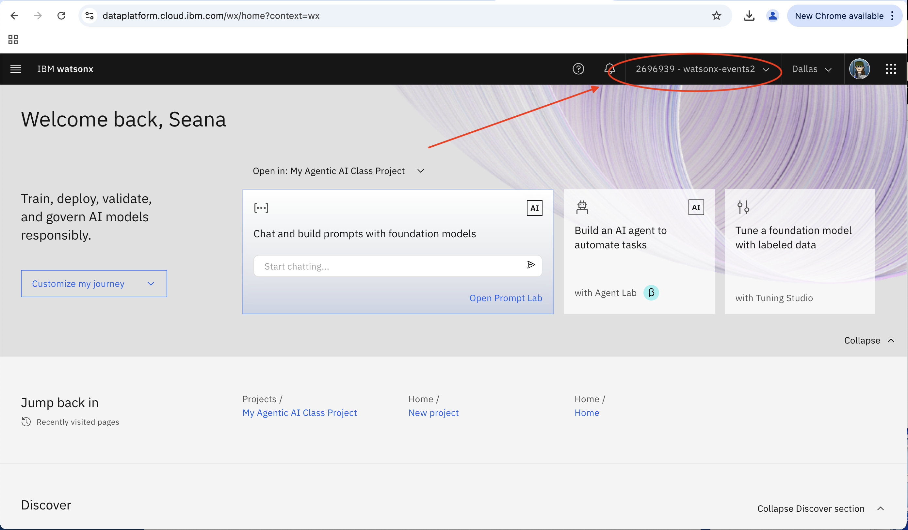

# Configuración del Proyecto - Nuevo Proyecto
---
## Resumen
Antes de comenzar el primer laboratorio técnico, repasaremos cómo crear tu propio proyecto para familiarizarte con watsonx.ai y asegurar que tengas acceso a tu entorno para el bootcamp.

¡Es importante que creemos un proyecto en el entorno correcto, o causará problemas más adelante!

## 📖 Tabla de Contenidos

- [Configuración del Proyecto - Nuevo Proyecto](#configuración-del-proyecto---nuevo-proyecto)
  - [Resumen](#resumen)
  - [📖 Tabla de Contenidos](#-tabla-de-contenidos)
    - [1. Iniciar sesión en watsonx](#1-iniciar-sesión-en-watsonx)
    - [2. Verificar que estás en la instancia correcta](#2-verificar-que-estás-en-la-instancia-correcta)
    - [3. Crear un nuevo proyecto](#3-crear-un-nuevo-proyecto)
    - [Cloud Object Storage (COS)](#cloud-object-storage-cos)
    - [Hacer clic en Crear](#hacer-clic-en-crear)
    - [4. Asociar la instancia de runtime correcta](#4-asociar-la-instancia-de-runtime-correcta)
  - [Pasos para Acceder al ID del Proyecto](#pasos-para-acceder-al-id-del-proyecto)

### 1. Iniciar sesión en watsonx
---
A continuación, sigue este enlace para iniciar sesión en watsonx: https://dataplatform.cloud.ibm.com/wx/home?context=wx

¡Por favor acepta los Términos y Condiciones!

### 2. Verificar que estás en la instancia correcta
---
Ahora deberías ser llevado a la pantalla de inicio de watsonx. Verifica en la parte superior derecha que estás en la instancia correcta. Si no muestra el nombre correcto de la instancia, puedes seleccionarlo en el menú desplegable. ¡Durante todo el bootcamp, trabajarás en esa misma instancia!

Si no conoces tu instancia, ve a tu lista de reservaciones de techzone https://techzone.ibm.com/my/reservations. Busca tu reservación creada recientemente y haz clic en "Open this environment". Desplázate hacia abajo y busca un nombre de reservación que se vea similar a esto: ITZ-WATSONX-21.

**Nota:** La instancia en la parte superior derecha tiende a cambiar a tu cuenta personal predeterminada cada vez que cambias/regresas a una nueva página. Por lo tanto, siempre es bueno verificar la esquina superior derecha cada vez que cambies a una nueva página.

### 3. Crear un nuevo proyecto
---
Ahora, podemos proceder y crear un nuevo proyecto.

En la sección **Proyectos**, haz clic en el símbolo "+" para crear un nuevo proyecto.

O, usa el enlace aquí para activar la creación de un [Nuevo Proyecto](https://dataplatform.cloud.ibm.com/projects/new-project?context=wx).

Ingresa un **nombre único** para tu proyecto, incluye tanto tu nombre como tu apellido y cualquier otra información que desees.

### Cloud Object Storage (COS)
Es probable que también haya una instancia de Cloud Object Storage ya seleccionada para ti, con un nombre que comience con "itzcos-..." ¡Si es así, no tienes que hacer nada!

De lo contrario, es posible que se te solicite seleccionar entre múltiples instancias. Por favor consulta con tu líder del bootcamp qué instancia COS seleccionar.

### Hacer clic en Crear
Ahora, haz clic en Crear. Puede tomar algunos segundos ser creado oficialmente.

### 4. Asociar la instancia de runtime correcta
---
Con el proyecto creado, deberías ser dirigido a la página de inicio del proyecto. Selecciona la pestaña "Gestionar".

Haz clic en "Servicios e Integraciones" en la barra lateral izquierda. Luego, haz clic en "Asociar servicio."

Selecciona el servicio listado con "Tipo" = "watsonx.ai Runtime" y haz clic en **Asociar**.

**Nota:** Si no puedes encontrar el servicio, remueve todos los filtros del menú desplegable "Ubicaciones". Si ves 2+ servicios Watson Machine Learning, selecciona el que tenga "Grupo" = el mismo nombre de *entorno* de la instancia. El nombre del *entorno* se puede encontrar en https://techzone.ibm.com/my/reservations.

6. Haz clic en el **menú hamburguesa (☰)** en la esquina superior izquierda y selecciona **"Acceso (IAM)"**.

   

7. En el menú de la izquierda, haz clic en **"Claves API"**.

   

8. Haz clic en **"Crear"** para generar una nueva clave API.

   

9. Ingresa un nombre para tu clave API y haz clic en **"Crear"**.

   

10. **Copia tu clave API** y guárdala en un lugar seguro. La necesitarás en pasos posteriores.

    

## Pasos para Acceder al ID del Proyecto

1. Haz clic en el menú hamburguesa (tres líneas horizontales) ubicado en la esquina superior izquierda de la pantalla. Verás todas las opciones de proyecto bajo la sección Proyecto.
   
    

2. Ahora serás redirigido a la lista de Proyectos, encuentra y haz clic en el proyecto con el que quieres trabajar.

     

3. Una vez dentro de la vista del proyecto, haz clic en el botón "Opciones de Gestión".

4. Después de hacer clic en "Opciones de Gestión", se mostrará el ID del Proyecto, copia el ID del Proyecto para uso posterior.

    

Ahora que hemos creado tanto el ID del Proyecto como la Clave API, procederemos con la creación de nuestros agentes.
