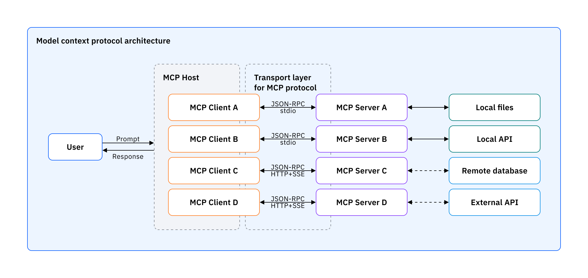

# 🤖 Agente de Operaciones de RRHH (MCP)


## Tabla de Contenidos
- [🤖 Agente de Operaciones de RRHH (MCP)](#-agente-de-operaciones-de-rrhh-mcp)
  - [Tabla de Contenidos](#tabla-de-contenidos)
  - [Descripción](#descripción)
  - [¿Qué hace este agente?](#qué-hace-este-agente)
  - [Cómo funciona](#cómo-funciona)
    - [Arquitectura Técnica](#arquitectura-técnica)
    - [Flujo de Operación](#flujo-de-operación)
    - [Herramientas Disponibles](#herramientas-disponibles)
  - [¿Qué es Model Context Protocol (MCP)?](#qué-es-model-context-protocol-mcp)
    - [Arquitectura General de MCP](#arquitectura-general-de-mcp)
    - [¿Por qué usar MCP?](#por-qué-usar-mcp)
    - [Conceptos Clave de MCP](#conceptos-clave-de-mcp)
    - [Implementación en Este Agente](#implementación-en-este-agente)
  - [Setup e Instalación](#setup-e-instalación)
    - [Prerrequisitos](#prerrequisitos)
    - [Instalación Local](#instalación-local)
    - [Instalación con Docker](#instalación-con-docker)
  - [Obtención de Credenciales](#obtención-de-credenciales)
    - [IBM Watsonx.ai](#ibm-watsonxai)
    - [Backend MCP](#backend-mcp)
    - [Archivo .env](#archivo-env)
  - [Ejemplos de Operaciones](#ejemplos-de-operaciones)
    - [1. Consultar Información de Empleado](#1-consultar-información-de-empleado)
    - [2. Solicitar Días de Licencia](#2-solicitar-días-de-licencia)
    - [3. Actualizar Dirección](#3-actualizar-dirección)
    - [4. Consultar Balance de Licencias](#4-consultar-balance-de-licencias)
    - [5. Actualizar Cargo](#5-actualizar-cargo)
  - [Endpoints de la API](#endpoints-de-la-api)
    - [GET /v1/agents](#get-v1agents)
    - [POST /v1/chat](#post-v1chat)
  - [Limitaciones y Consideraciones](#limitaciones-y-consideraciones)
  - [Soporte y Mantenimiento](#soporte-y-mantenimiento)


## Descripción

El **Agente de Operaciones de RRHH** es un agente de inteligencia artificial especializado en la gestión integral de operaciones de recursos humanos. Este agente utiliza el protocolo MCP (Model Context Protocol) para conectarse con sistemas backend de RRHH, permitiendo a los empleados realizar consultas y operaciones de manera natural y eficiente.

## ¿Qué hace este agente?

Este agente automatiza y facilita las siguientes operaciones de recursos humanos:

- **Consulta de información de empleados**: Obtiene detalles completos de cualquier empleado por nombre o ID
- **Gestión de licencias**: Consulta días de licencia gozados y procesa nuevas solicitudes
- **Actualización de datos**: Modifica información personal como dirección y cargo
- **Validación automática**: Verifica límites de licencia y políticas de RRHH
- **Interfaz conversacional**: Permite interacción natural en español

## Cómo funciona

### Arquitectura Técnica

El agente está construido utilizando las siguientes tecnologías:

- **Framework**: LangGraph para la orquestación de agentes
- **LLM**: IBM Watsonx.ai (meta-llama/llama-3-2-90b-vision-instruct)
- **Protocolo**: Model Context Protocol (MCP) para comunicación con backend
- **API**: FastAPI con soporte para streaming
- **Despliegue**: Docker containerizado

### Flujo de Operación

1. **Recepción de consulta**: El usuario envía una consulta en lenguaje natural
2. **Análisis de intención**: El LLM analiza la consulta y determina qué herramientas usar
3. **Ejecución de herramientas**: Se conecta al backend MCP para realizar operaciones
4. **Procesamiento de respuesta**: Los datos se formatean en markdown para mejor legibilidad
5. **Entrega de resultado**: Se proporciona una respuesta clara y estructurada al usuario

### Herramientas Disponibles

- `rrhh_obtener_detalles_empleado`: Obtiene información completa del empleado
- `rrhh_actualizar_direccion`: Actualiza la dirección de residencia
- `rrhh_actualizar_cargo`: Modifica el cargo/posición del empleado
- `rrhh_consultar_dias_licencia`: Consulta el balance de días de licencia
- `rrhh_solicitar_licencia`: Procesa solicitudes de licencia con validaciones

## ¿Qué es Model Context Protocol (MCP)?

Model Context Protocol (MCP) es un protocolo abierto que estandariza cómo las aplicaciones proporcionan contexto a los modelos de lenguaje grandes (LLMs). MCP es como "un puerto USB-C para aplicaciones de IA" - al igual que USB-C proporciona una forma estandarizada de conectar dispositivos a varios periféricos y accesorios, MCP proporciona una forma estandarizada de conectar modelos de IA a diferentes fuentes de datos y herramientas.

### Arquitectura General de MCP

MCP sigue una arquitectura cliente-servidor donde una aplicación host puede conectarse a múltiples servidores:



**Componentes principales:**

- **MCP Clients**: Clientes del protocolo que mantienen conexiones 1:1 con servidores
- **MCP Servers**: Programas ligeros que exponen capacidades específicas a través del protocolo estandarizado
- **Local Data Sources**: Archivos, bases de datos y servicios de tu computadora a los que los servidores MCP pueden acceder de forma segura
- **Remote Services**: Sistemas externos disponibles a través de internet (ej: APIs) a los que los servidores MCP pueden conectarse

### ¿Por qué usar MCP?

MCP ayuda a construir agentes y flujos de trabajo complejos sobre LLMs proporcionando:

1. **Lista creciente de integraciones pre-construidas** que tu LLM puede usar directamente
2. **Flexibilidad para escalar**, el agente es capaz de evolucionar automáticamente con el sistema.
3. **Mejores prácticas** para asegurar tus datos dentro de tu infraestructura

### Conceptos Clave de MCP

- **Resources**: Exponen datos y contenido de tus servidores a los LLMs
- **Tools**: Permiten a los LLMs realizar acciones a través de tu servidor
- **Prompts**: Crean plantillas de prompts reutilizables y flujos de trabajo
- **Transports**: Mecanismo de comunicación de MCP (basado en JSON-RPC 2.0)

### Implementación en Este Agente

En nuestro agente de RRHH, MCP funciona como el puente entre el LLM y el sistema backend de recursos humanos. El agente actúa como cliente MCP, conectándose a un servidor MCP que expone las herramientas de RRHH como `rrhh_obtener_detalles_empleado`, `rrhh_solicitar_licencia`, etc.

Esta arquitectura permite:
- **Separación de responsabilidades**: La lógica de negocio de RRHH está en el servidor MCP
- **Reutilización**: El mismo servidor MCP puede ser usado por múltiples clientes
- **Escalabilidad**: Nuevas herramientas pueden agregarse al servidor sin modificar el cliente
- **Seguridad**: Los datos sensibles de RRHH permanecen en el servidor backend

*Fuente: [IBM Think - What is Model Context Protocol (MCP)?](https://www.ibm.com/think/topics/model-context-protocol)*

## Setup e Instalación

### Prerrequisitos

- Python 3.12+
- Docker (opcional)
- Acceso a IBM Watsonx.ai
- Backend MCP de RRHH funcionando

### Instalación Local

1. **Crear un entorno virtual**:

  - **En macOS/Linux**:
    ```bash
    python3 -m venv venv
    source venv/bin/activate
    ```
  - **En Windows**:
    ```cmd
    python -m venv venv
    venv\Scripts\activate
    ```

3. **Instalar dependencias**:
    ```bash
    pip install -r requirements.txt
    ```

4. **Configurar variables de entorno**:
  ```bash
  cp .env.example .env
  # Editar .env con las credenciales correspondientes
  ```

5. **Ejecutar el agente**:
  ```bash
  python3 app.py
  ```

### Instalación con Docker

1. **Construir la imagen**:
```bash
docker build -t rrhh-agente-mcp .
```

2. **Ejecutar el contenedor**:
```bash
docker run -p 8080:8080 --env-file .env rrhh-agente-mcp
```

## Obtención de Credenciales

### IBM Watsonx.ai

1. Acceder a [IBM Cloud](https://cloud.ibm.com)
2. Crear un proyecto en Watsonx.ai
3. Asociar un Watsonx.ai Runtime a ese proyecto en _Manage_
4. Obtener:
   - `WATSONX_PROJECT_ID`: ID del proyecto
   - `WATSONX_API_KEY`: Clave de API de IBM Cloud
   - `WATSONX_URL`: URL del servicio Watsonx

### Backend MCP

1. Asegurar que el backend MCP esté desplegado
2. Configurar:
   - `RRHH_BACKEND_MCP_URL`: URL del servidor MCP

### Archivo .env

```env
WATSONX_PROJECT_ID="your_project_id"
WATSONX_API_KEY="your_api_key"
WATSONX_URL="https://your-watsonx-url"
RRHH_BACKEND_MCP_URL="http://localhost:8080"
```

## Ejemplos de Operaciones

### 1. Consultar Información de Empleado

**Entrada (JSON Schema)**:
```json
{
  "model": "watsonx",
  "messages": [
    {
      "role": "user",
      "content": "Muéstrame la información de Juan Pablo Tejera"
    }
  ],
  "stream": false
}
```

**Salida esperada**:
```markdown
## Detalles del Empleado

**Número de Empleado:** 81
**Nombre Completo:** Juan Pablo Tejera
**Cargo:** Desarrollador Backend
**Dirección:** Pasadizo Manuel Campos 43 Puerta 7, Burgos, 13133
**Días de Licencia Gozados:** 16
```

### 2. Solicitar Días de Licencia

**Entrada (JSON Schema)**:
```json
{
  "model": "watsonx",
  "messages": [
    {
      "role": "user",
      "content": "Quiero solicitar licencia del 15/06/2025 al 19/06/2025 mi nombre es Juan Pablo Tejera"
    }
  ],
  "stream": false
}
```

**Salida esperada**:
```markdown
## Solicitud de Licencia Aprobada

**Empleado:** Juan Pablo Tejera
**Período de Licencia:** 15/06/2025 - 19/06/2025
**Días Solicitados:** **5** días
**Total Días Gozados:** **21** días
**Días Restantes:** **9** días

Su solicitud de licencia ha sido aprobada y registrada exitosamente.
```

### 3. Actualizar Dirección

**Entrada (JSON Schema)**:
```json
{
  "model": "watsonx",
  "messages": [
    {
      "role": "user",
      "content": "Actualiza la dirección de Faustino Carrera a 'Calle Nueva 123, Madrid, 28001'"
    }
  ],
  "stream": false
}
```

**Salida esperada**:
```markdown
## Dirección Actualizada

**Empleado:** Faustino Carrera
**Nueva Dirección:** **Calle Nueva 123, Madrid, 28001**

La dirección ha sido actualizada exitosamente.
```

### 4. Consultar Balance de Licencias

**Entrada (JSON Schema)**:
```json
{
  "model": "watsonx",
  "messages": [
    {
      "role": "user",
      "content": "¿Cuántos días de licencia tiene disponibles Araceli Garrido?"
    }
  ],
  "stream": false
}
```

**Salida esperada**:
```markdown
## Días de Licencia Gozados

**Empleado:** Araceli Garrido
**Días de Licencia ya Gozados:** **13** días
**Días restantes disponibles:** **17** días
```

### 5. Actualizar Cargo

**Entrada (JSON Schema)**:
```json
{
  "model": "watsonx",
  "messages": [
    {
      "role": "user",
      "content": "Cambia el cargo de Brígida Bayo a 'Senior Consultant'"
    }
  ],
  "stream": false
}
```

**Salida esperada**:
```markdown
## Cargo Actualizado

**Empleado:** Brígida Bayo
**Nuevo Cargo:** **Senior Consultant**

El cargo ha sido actualizado exitosamente.
```

## Endpoints de la API

### GET /v1/agents
Endpoint de descubrimiento de agentes compatible con Agent Connect Protocol.

### POST /v1/chat
Endpoint principal para interacción con el agente. Soporta streaming y modo sincrónico.

**Headers**:
- `x-thread-id` (opcional): Identificador de hilo de conversación

**Request Body**:
```json
{
  "model": "string",
  "messages": [
    {
      "role": "user|assistant",
      "content": "string"
    }
  ],
  "stream": boolean
}
```

## Limitaciones y Consideraciones

- **Límite de licencia**: Máximo 30 días de licencia por año por empleado
- **Formato de fechas**: Las fechas deben estar en formato dd/mm/yyyy
- **Identificación de empleados**: Se puede usar nombre completo o número de empleado
- **Dependencia del backend**: Requiere que el servidor MCP esté disponible
- **Autenticación**: Actualmente no implementa autenticación de usuarios

## Soporte y Mantenimiento

Para soporte técnico o reportar problemas:
- Revisar logs del contenedor/aplicación
- Verificar conectividad con el backend MCP
- Validar credenciales de Watsonx.ai
- Consultar documentación de IBM Watsonx.ai