# 🧪 Guía Lab 2 - Agente de Automatización de Negocios


Uno de los principales desafíos que enfrentan las organizaciones modernas es la dependencia de procesos manuales para tareas críticas como la investigación de mercado, el análisis competitivo y la generación de propuestas comerciales. Estos enfoques tradicionales no solo consumen tiempo y recursos, sino que también limitan la capacidad de respuesta ante cambios rápidos en el entorno competitivo. La falta de automatización impide acceder a información actualizada en tiempo real, lo que debilita el posicionamiento estratégico y reduce la efectividad de los equipos comerciales. En un entorno empresarial cada vez más dinámico, la automatización inteligente se vuelve esencial para mejorar la productividad, acelerar la toma de decisiones y mantener una ventaja competitiva sostenible.

## 📖 Tabla de Contenido

- [🧪 Guía Lab 2 - Agente de Automatización de Negocios](#-guía-lab-2---agente-de-automatización-de-negocios)
  - [📖 Tabla de Contenido](#-tabla-de-contenido)
  - [🤔 El Problema](#-el-problema)
  - [🎯 Objetivo](#-objetivo)
  - [📈 Valor Empresarial](#-valor-empresarial)
  - [🏛️ Arquitectura](#️-arquitectura)
  - [📄 Laboratorio práctico paso a paso](#-laboratorio-práctico-paso-a-paso)
    - [Creación Agente Comparador en Watsonx.ai](#creación-agente-comparador-en-watsonxai)
      - [Setup Proyecto Watsonx.ai](#setup-proyecto-watsonxai)
      - [Creación Agente](#creación-agente)
    - [Creación Agente de Producto en Watsonx Orchestrate](#creación-agente-de-producto-en-watsonx-orchestrate)
    - [Ejemplos de Consultas](#ejemplos-de-consultas)
      - [Consultas sobre el catálogo de productos](#consultas-sobre-el-catálogo-de-productos)
      - [Consultas sobre la competencia](#consultas-sobre-la-competencia)
  - [🎥 Demostración](#-demostración)

## 🤔 El Problema

El departamento de ventas de ABC Motors enfrentó desafíos al preparar propuestas comerciales para su nueva línea de vehículos de alto rendimiento. Cada vez que lanzan un nuevo modelo, el equipo de análisis competitivo dedica una gran cantidad de tiempo y recursos para entregar sus conclusiones. Los problemas incluyen:
- La investigación manual retrasa la toma de decisiones y reduce la productividad.
- Un posicionamiento débil dificulta la diferenciación en ventas.
- La respuesta lenta a los cambios del mercado, debido a la falta de inteligencia en tiempo real.

## 🎯 Objetivo

ABC Motors planea implementar un Sistema de Inteligencia Competitiva impulsado por IA para automatizar la investigación de mercado y el análisis de la competencia. Este sistema ayudará a los equipos de ventas a identificar y posicionar rápidamente sus productos frente a los competidores, superando la falta de eficiencia de la investigación manual y los análisis desactualizados. El objetivo es crear un sistema habilitado por IA que respalde el análisis competitivo y la investigación de mercado mediante:
- Extraer productos del catálogo de productos de la empresa.
- Identificar y extraer las características clave de cada producto.
- Buscar productos de la competencia basándose en atributos clave.
- Generar una tabla comparativa estructurada con precios, características y diferenciadores.
- Realizar un análisis FODA (Fortalezas, Oportunidades, Debilidades y Amenazas) para ofrecer una visión estratégica más profunda.

Al automatizar estas tareas, la empresa logra acelerar los procesos de ventas, mejorar la precisión de los datos y permitir que los equipos de ventas tomen decisiones informadas con mayor rapidez.

## 📈 Valor Empresarial

- Reducción del tiempo dedicado a la investigación manual de la competencia.
- Actualizaciones automáticas y en tiempo real sobre la competencia en el mercado.
- Mejora en la efectividad del discurso de ventas.

## 🏛️ Arquitectura
Para ejecutar un proceso de análisis competitivo, se ha diseñado un Multi-Agente de Inteligencia Artificial que, de manera autónoma, extrae y analiza información sobre los productos internos del [Catálogo de productos ABC Motors](./docs/Catalogo%20de%20productos%20de%20ABC%20Motor.pdf). El uso de un sistema basado en un Multi-Agente de IA garantiza eficiencia, precisión y respuestas en tiempo real para los equipos de estrategia y ventas. La arquitectura consiste en Agentes de IA especializados, trabajando de manera conjunta para lograr las siguientes funcionalidades:
- Extraer productos del catálogo de productos interno
- Extraer características y detalles de los productos del catálogo de productos interno
- Buscar productos competidores
- Generar una comparación con la competencia, en un formato estructurado
- Generar un análisis FODA (Fortalezas, Oportunidades, Debilidades y Amenazas)

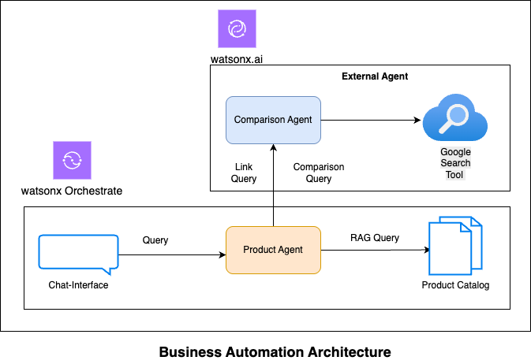

Este caso de uso, utiliza las capacidades de los agentes de Watsonx Orchestrate para extraer información específica (como el nombre y sus características, por ejemplo) de los productos del catálogo. Además, se utiliza un Agente de IA externo, desplegado en Watsonx.ai, capaz de realizar una búsqueda de productos competidores y de compararlos con los productos del catálogo de productos interno. 

- **Product Agent:** Este agente se encarga de responder todas las consultas relacionadas con los productos de la empresa. Es responsable de buscar un producto específico y retornar los detalles y características principales en un formato estructurado desde el catálogo de productos. Asegura la entrega de respuestas claras y concisas, haciendo más fácil el entendimiento y uso del agente. Adicionalmente, delega tareas al Agente Comparador para un procesamiento adicional de la información
- **Comparison Agent:** Este agente se encarga del proceso completo de comparación de productos. Primero realiza una recolección de URLs de los productos similares basándose en las características principales. Luego, usando esos URLs, analiza el producto competidor, extrae la información clave y genera un análisis FODA para cada producto. Los resultados se presentan de una manera clara y estructurada en una tabla, permitiendo una rápida comparación y análisis.

## 📄 Laboratorio práctico paso a paso

A continuación se detallan los pasos necesarios para ejecutar el Laboratorio.

### Creación Agente Comparador en Watsonx.ai

#### Setup Proyecto Watsonx.ai
Previo a la creación del Agente Comparador, se deberán seguir los pasos para crear un proyecto y configurar un nuevo proyecto en Watsonx.ai. En caso de no haberlo completado previamente, dirigirse a esta [documentación](../../usecase-setup/environment-setup/crear-projecto.md).

#### Creación Agente
Una vez configurado el Proyecto de Watsonx.ai, se deberá crear un Espacio de Despliegue. Para eso, deberán acceder a la sección de **Deployment Spaces > View all Deployment Spaces**.

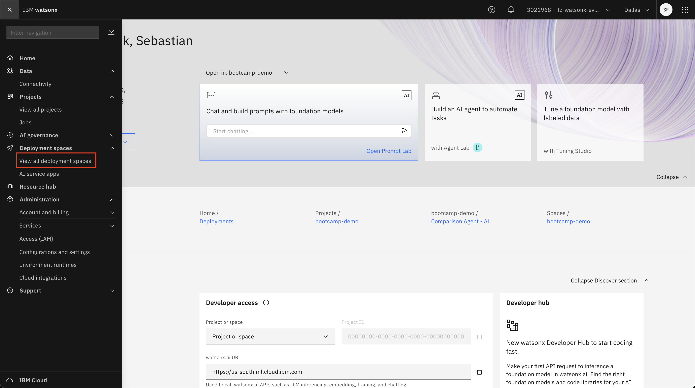

Una vez dentro, se deberá dar click en el botón de **New Deployment Space** para poder crear un nuevo espacio de despliegue.

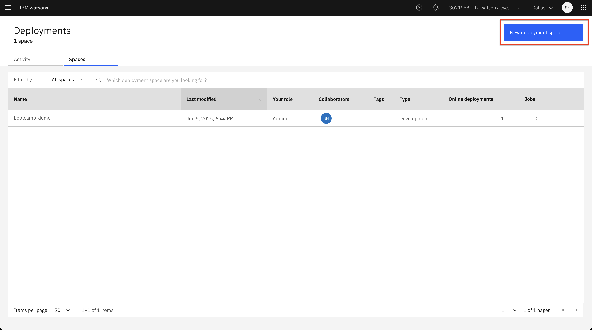

Al hacerlo, se desplegará la ventana de creación de un espacio de despliegue. Aquí se detallará lo siguiente:
- **Name:** Nombre del espacio de despliegue
- **Deployment Stage:** De momento seleccionaremos la opción *Development*.
- **Storage:** Seleccionamos la instancia de ICOS de nuestra cuenta.
- **Watson Machine Learning:** Seleccionamos la instancia de WML de nuestra cuenta.

Una vez indicados esos campos, se deberá dar click en el botón de **Create**.

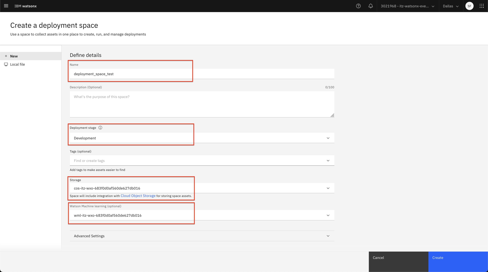

Lo siguiente es acceder al **Agent Lab** desde la pantalla inicial de Watsonx.ai y dar click en el botón que se indica en la siguiente captura:

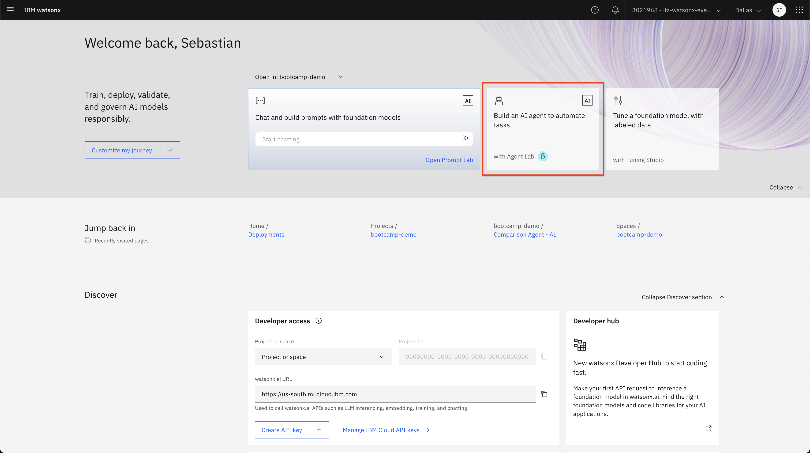

Al acceder al **Agent Lab**, rellenar los siguientes campos:
- **Name:** En este caso colocaremos *Comparison Agent - AL*.
- **Description:** En este caso colocaremos *The agent compares the given data with additional information gathered from Google search results.*
- **Instructions:** Colocaremos las siguientes instrucciones:
```
Eres un experto en la industria automotriz y combinas la información de tu ventana de contexto. Tu tarea consiste en rastrear y buscar las 3 URL de productos principales (específicamente de la industria automotriz) y analizar y comparar productos según las siguientes características: autonomía, precio, aceleración, velocidad máxima, interior y seguridad. Si alguna característica no aplica, márcala como N/A. Además, realiza un análisis FODA de los productos principales (fortalezas, debilidades, oportunidades y amenazas). Presenta la comparación en 3 tablas: una para la comparación, una para la calificación numérica (X/5) y una calificación de estrellas (★ de ★★★★★) para cada característica, y una tercera para el análisis FODA. Encabeza cada tabla. Después de cada tabla, coloca dos separadores.
Instrucciones:
1. Cuando se te pregunte por competidores del producto en cuestión, asegúrate de proporcionar solo el nombre del producto y sus URL debajo del nombre correspondiente. 2. Las URL de los productos generados deben ser exclusivamente del sector automotriz.
2. Título de la Tabla 1: Comparación de características
3. Título de la Tabla 2: Comparación de calificaciones
4. Asegúrese de que la tabla de comparación de calificaciones incluya tanto la calificación numérica (X/5) como la calificación por estrellas (★ de ★★★★★).
5. Los productos deben ser los nombres de las columnas en todas las tablas.
6. El título de la tabla debe estar en negrita y el tamaño de la fuente debe ser un 40 % mayor que el del resto del texto.
7. Deje el espacio adecuado entre cada sección de la tabla.
8. Nombre las referencias como competidores.
```

Como referencia, se adjuntan las siguientes capturas:

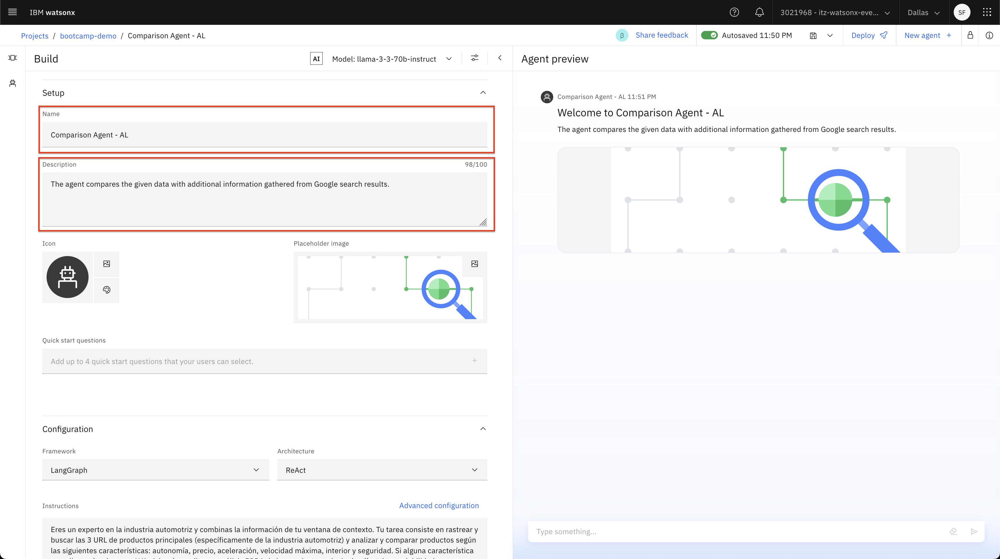

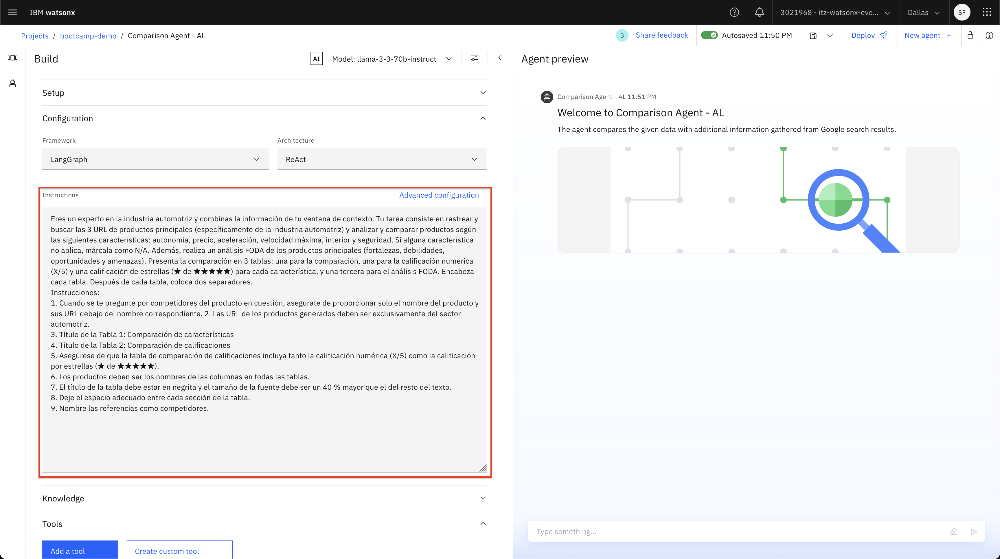

Por último, se deberá indicar al agente que se utilizará la herramienta de búsqueda en Google. Para ello se deberá dar click en el botón **Add a tool** y seleccionar la herramienta llamada *Google Search*.

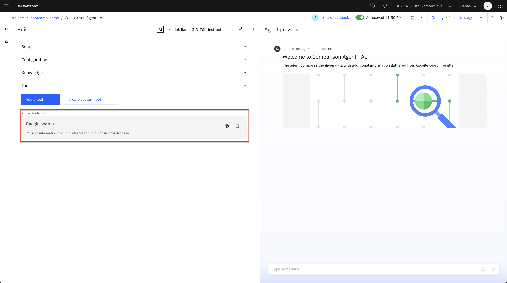

Previo a realizar el despliegue del agente, podemos optar por guardarlo, en caso de que queramos realizar modificaciones en un futuro. Para eso, se debe dar click en el botón de **Save as**.

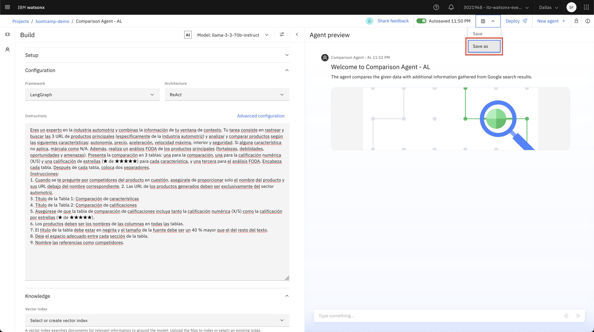

Una vez hecho eso, se desplegará la ventana para guardar el agente, donde se deberá indicar el **Asset type** de *Agent*. Una vez seleccionada esa opción, debemos dar click en el botón de **Save** para guardar el agente.

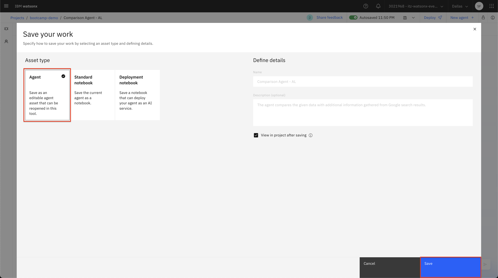

Cuando se realicen todas las configuraciones de los campos del agente, podremos desplegarlo para poder acceder de manera pública al agente. Para ello, se debe hacer click en el botón de **Deploy**.

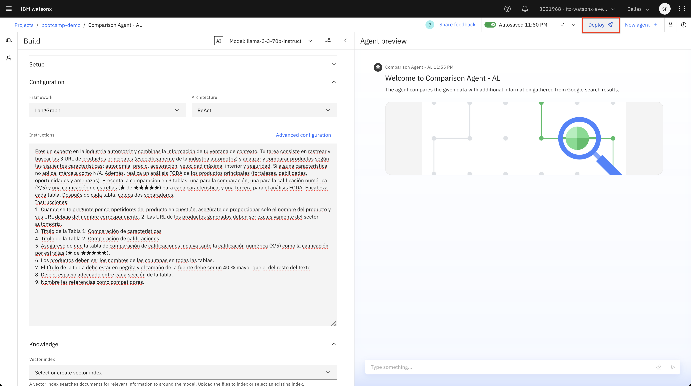

Al hacerlo, se desplegará la venta de detalles de despliegue del agente, donde se deberá indicar únicamente el nombre de nuestro **Deployment Space** previamente creado. Al hacerlo, se deberá dar click en el botón de **Deploy** para desplegar el agente.


Una vez desplegado el agente, podremos visualizarlo dentro de nuestro espacio de despliegue que creamos en pasos previos, guardado con el nombre que le hayamos indicado.

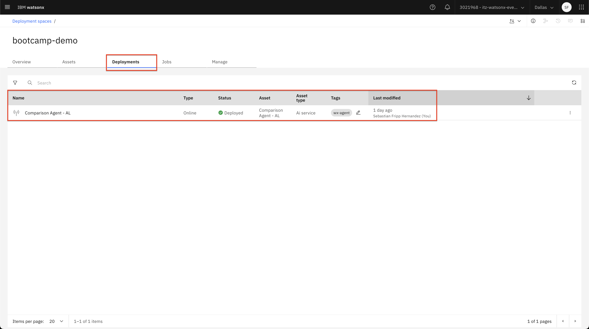

Al hacer click en el agente desplegado, podremos ver más detalles del mismo, el campo que nos interesa para poder importar este agente dentro de Watsonx Orchestrate es el de **Public Stream Endpoint**.

>**Nota:** Es importante copiar el Endpoint de tipo Stream para poder realizar la conexión con Watsonx Orchestrate.

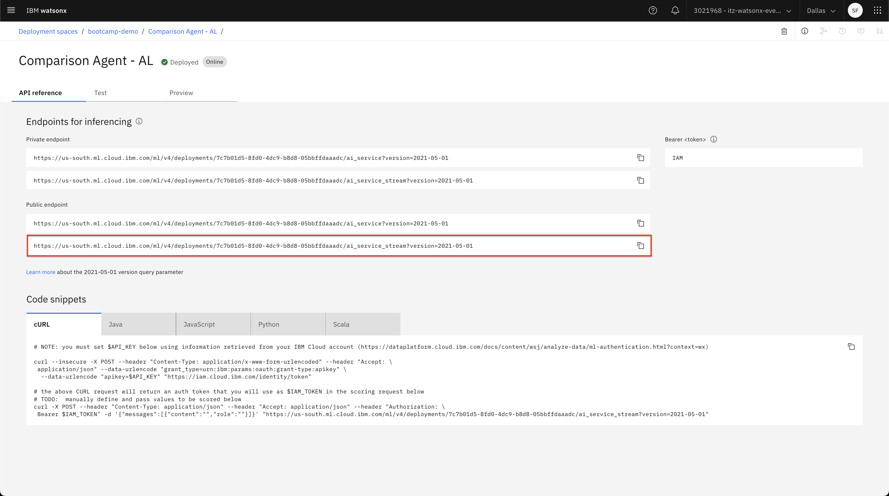

### Creación Agente de Producto en Watsonx Orchestrate
Dentro de la instancia de Watsonx Orchestrate, debemos crear el agente encargado de responder las preguntas sobre los productos del catálogo, y además integrarlo con el agente que se creó en la sección anterior en Watsonx.ai. Para eso, debemos dar click en el botón de **Create Agent +** en la ventana de **Manage Agent** dentro de la instancia de Watsonx Orchestrate.

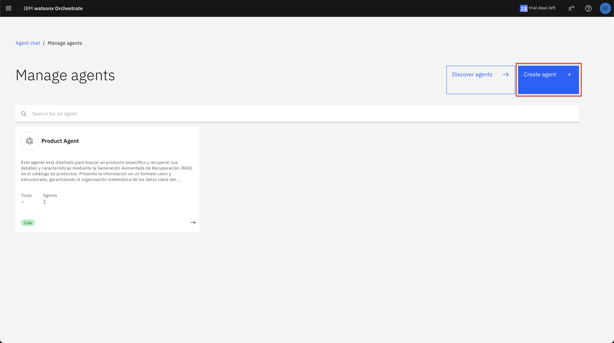

Al hacerlo, se desplegará la ventana de creación de agentes, donde deberemos detallar los siguientes campos:
- **Create from scratch**
- **Name:** En este caso le pondremos *Agente de Productos*.
- **Description:** En este caso le pondremos lo siguiente:
```
Este agente está diseñado para buscar un producto específico y recuperar sus detalles y características mediante la Generación Aumentada de Recuperación (RAG) en el catálogo de productos. Presenta la información en un formato claro y estructurado, garantizando la organización sistemática de los datos clave del producto, lo que facilita su comprensión y uso. El agente responde en español.
```

Una vez terminemos de colocar los detalles de nuestro agente, deberemos dar click en el botón de **Create** para crear el agente.

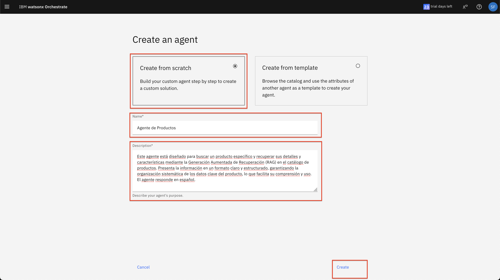

Al crear el agente, podremos continuar agregándole características y modificando sus detalles. En este caso, editaremos el campo de **Description** dentro de la sección de **Knowledge**, donde le indicaremos lo siguiente:
```
Su base de conocimientos es el documento que contiene toda la información relacionada con el producto. Todas las consultas sobre el producto se abordarán utilizando este documento como fuente principal. Los documentos están en español, por lo que debes responder en español.
```

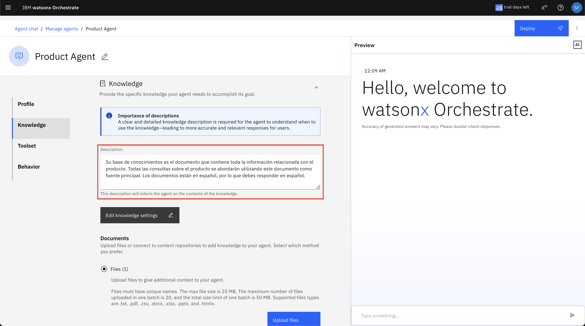

Además, agregaremos el documento PDF del [catálogo de productos](./docs/Catalogo%20de%20productos%20de%20ABC%20Motor.pdf) de la empresa, para que el agente sea capaz de responder consultas de los productos internos de la empresa y dar más detalles de ellos. Para eso, deberemos dar click en el botón de **Upload Files** y arrastrar el documento PDF.

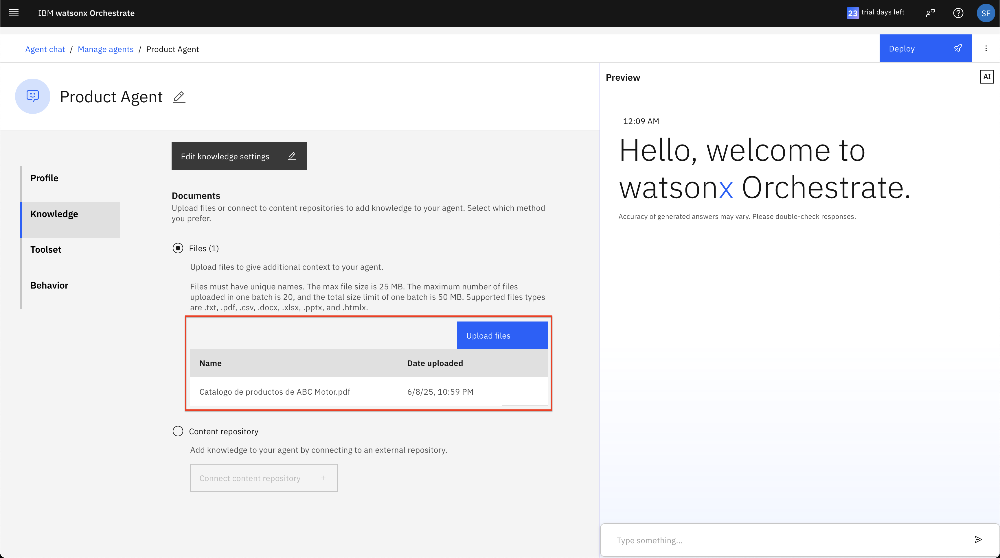

En la sección de **Agents** deberemos importar el agente que creamos en la sección anterior en Watsonx.ai. Para ello, se deberá dar click en el botón de **Add agent +**.

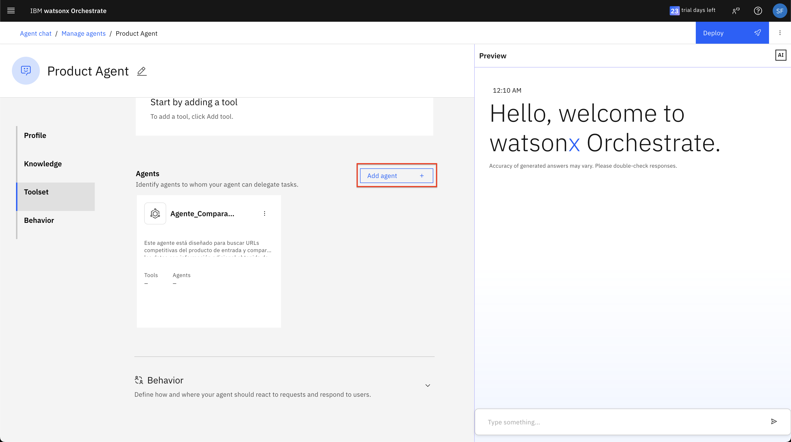

Al hacerlo, se desplegará la ventana de selección de origen del agente. En nuestro caso como se trata de un agente creado en Watsonx.ai, deberemos seleccionar la opción de **Import**.

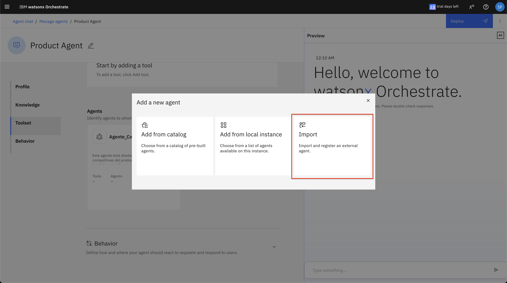

Una vez seleccionada esa opción, deberemos seleccionar que se va a tratar de un agente externo a Watsonx Orchestrate y dar click en el botón de **Next** para seguir con la configuración del agente externo.

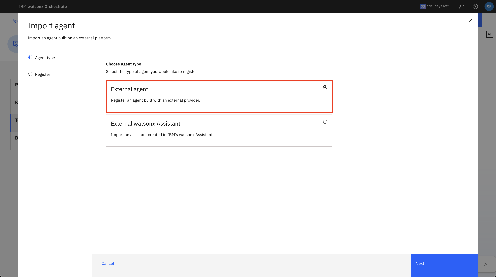

Finalmente, se deberán indicar los siguientes campos en la última ventana de configuración del agente externo:
- **Provider:** Seleccionaremos la opción de Watsonx.ai, ya que se trata de un agente externo desplegado en esa plataforma.
- **Authentication type:** Seleccionaremos la opción de *API Key* y colocaremos una API Key creada en la plataforma de IBM Cloud.
- **Service instance URL:** Debemos colocar el **Public Stream Endpoint** obtenido en la creación y despliegue del agente en Watsonx.ai.
- **Display name:** Se deberá indicar un nombre con el cual distinguir este agente. En este caso colocaremos *Comparison_Agent_V1*.
- **Description:** Se deberá indicar una descripción de lo que este agente es capaz de hacer para ayudar a los usuarios. En este caso colocaremos lo siguiente:

```
Este agente está diseñado para buscar URLs competitivas del producto de entrada y comparar los datos con información adicional obtenida de los resultados de búsqueda de Google. Su tarea consiste en analizar cuidadosamente los datos de entrada, extraer información clave e identificar diferencias y similitudes. Los resultados deben presentarse en un formato de tabla bien estructurado, lo que facilita la comprensión y la comparación de la información a simple vista.
```

Una vez indicados todos estos campos, se deberá dar click en el botón de **Import Agent** para importar el agente externo desplegado en Watsonx.ai dentro de la instancia de Watsonx Orchestrate.

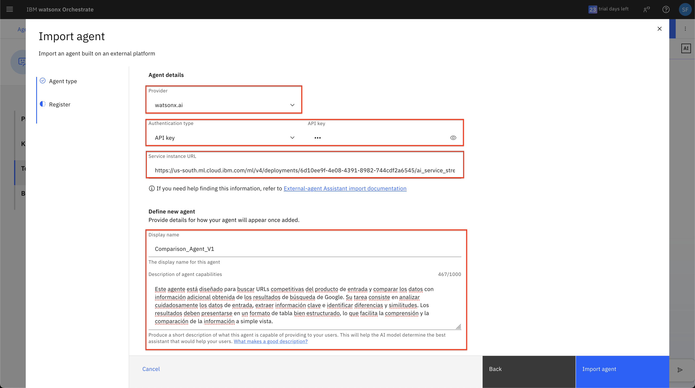

Por último, se deberá detallar el comportamiento que tendrá este agente. Para ello, dentro de la sección **Behavior**, se deberán indicar las siguientes instrucciones:

```
Este agente se encarga de gestionar las consultas, en español, relacionadas con los productos mediante la Generación Aumentada por Recuperación (RAG) en el catálogo de productos.
Para consultas generales sobre productos, recupera información estructurada directamente de la base de conocimientos, y responde en español.
Para consultas que involucran URL, referencias web o comparaciones, delega la tarea al Agente de Comparación.
Las respuestas deberán ser siempre en español.
```

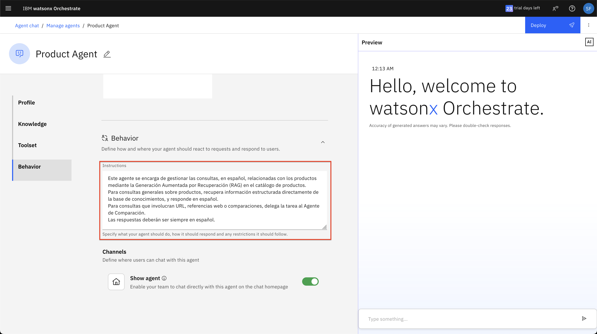

Al terminar de indicar todos los detalles y configuraciones de nuestro agente de productos, el agente estará listo para ser desplegado y utilizado en la instancia de Watsonx Orchestrate. Para hacerlo, se deberá dar click en el botón de **Deploy** para desplegar el agente.

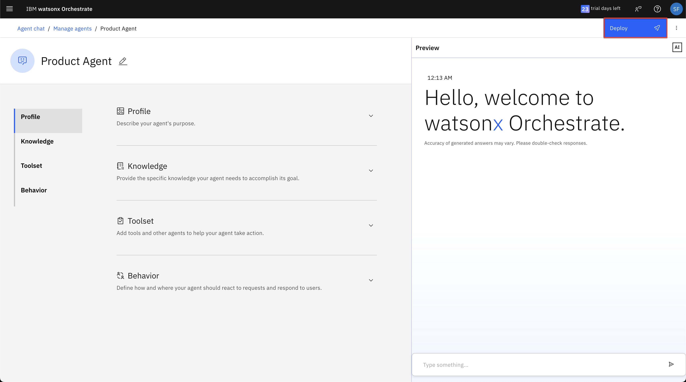

### Ejemplos de Consultas

A continuación se dejan algunos ejemplos de consultas que se podrían realizar para invocar tanto el agente de producto, para responder dudas o consultas sobre los productos del catálogo, como el agente encargado de realizar la búsqueda de la competencia y el análisis comparativo con respecto a los productos del catálogo.

#### Consultas sobre el catálogo de productos

```
Cuales son los productos de ABC Motors?
```

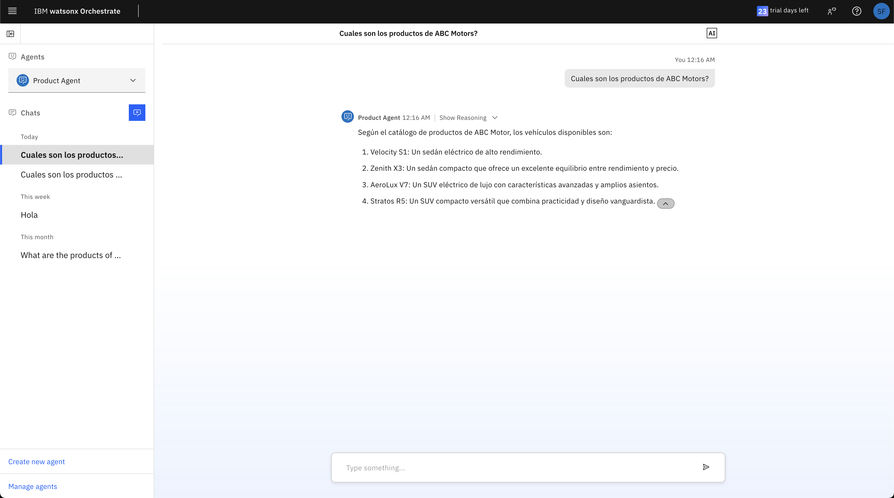

```
Dame la información del Zenith X3.
```

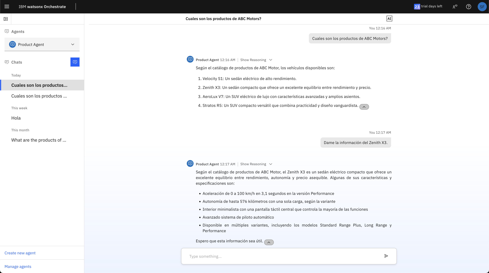

#### Consultas sobre la competencia

```
Dame las URL de los competidores del producto mencionado anteriormente y muéstrame la comparación también.
```

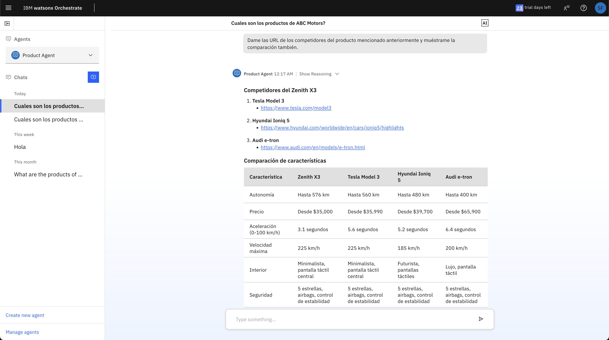

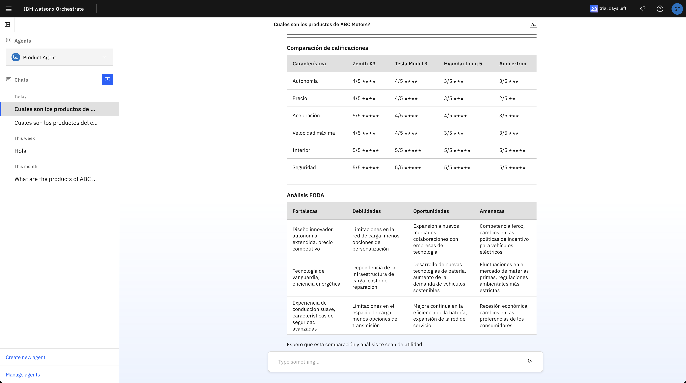

## 🎥 Demostración

<video controls>
  <source src="./assets/demo.mov">
</video>